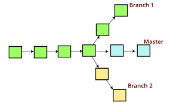

# Presintation

* Bracnh

---
> Команда git branch позволяет создавать, просматривать, переименовывать и удалять ветки.

>Ветка в Git — это набор коммитов, расположенных в хронологическом порядке. У каждой ветки есть свое название. Основная ветка чаще всего называется master, она появляется при инициализации репозитория и считается главной веткой проекта.

> Как создать ветку в командной строке GitHub?
> Получите доступ к интерфейсу командной строки. Убедитесь, что вы находитесь в каталоге локального репозитория Git. Создайте ветку: Чтобы создать новую ветку и остаться на текущей ветке: git branch <your-git-branch-name> Чтобы создать новую ветку и немедленно переключиться на нее: git checkout -b   <your-git-branch-name>

> Что такое git pull?
git pull | Atlassian Git Tutorial
Команда git pull используется для извлечения и загрузки содержимого из удаленного репозитория и немедленного обновления локального репозитория этим содержимым. Слияние удаленных вышестоящих изменений в локальный репозиторий — это обычное дело в процессе совместной работы на основе Git.

> Чем отличается Fetch от Pull?
Команда pull автоматически сливает коммиты, не давая вам сначала просмотреть их. Если вы не пристально следите за ветками, выполнение этой команды может привести к частым конфликтам. При использовании fetch , git собирает все коммиты из целевой ветки, которых нет в текущей ветке, и сохраняет их в локальном репозитории.

> Как получить имя ветки git в терминале?
Использование команды `git status`
Команда `git status` предоставляет много информации о состоянии вашего рабочего каталога и области подготовки. Среди этой информации она также показывает имя

> Команда git br показывает все ваши ветки
а команда git br -v показывает последний коммит который был сделан в этой ветке, а команда git l показывает полную информацию.

> Команда git br "develop" мы создаем с помощью  этой команды bracnch вводим команду git co branch develop с помощью этого мы перейдем в эту ветку.

> Чтобы сразу создать и перейту в другую ветку мы можем ввести команду git co -b "hihi".
чтобы переименовать ветку мы пишем git br -m "HOHO"
.

> Чтобы бросить локальную ветку в глобальную мы пишем git pull.

---

 